<div align="center">



<p>
  
  
  
  
  
</p>

<em>How to develop, build, and deploy the devlog documentation site.</em>

</div>


## Contents

- [What this is](#what-this-is)
- [Local development](#local-development)
- [Project structure](#project-structure)
- [Deployment](#deployment)
- [Validation](#validation)

## What this is

The [Astro Starlight](https://starlight.astro.build) documentation site for
[`devlog`](https://github.com/w3lt/devlog), the Rust CLI published as the
`d3vlog` crate.

This project is intentionally self-contained under `docs/`: everything here is
about building and shipping the docs. The repository root
[`README.md`](../README.md) remains the GitHub and crates.io front page.

## Local development

**Requirements:** Node **24** and [pnpm](https://pnpm.io) — the repo pins
`pnpm@11.5.2` via the `packageManager` field, so `corepack` will select it
automatically.

Run these from this `docs/` directory:

| Command | What it does |
|---|---|
| `pnpm install` | Install dependencies. |
| `pnpm dev` | Start the dev server with hot reload. |
| `pnpm check` | Type-check content collections and config (`astro check`). |
| `pnpm build` | Build the static site into `dist/`. |
| `pnpm preview` | Serve the built site locally. |

With `base: '/devlog'` set in `astro.config.mjs`, dev and preview serve the
site under `/devlog`, for example:

```text
http://localhost:4321/devlog
```

## Project structure

```
docs/
├── astro.config.mjs        # site + base '/devlog', sidebar, Starlight integration
├── package.json            # scripts (dev/check/build/preview) and dependencies
├── pnpm-workspace.yaml     # workspace settings + allowed native builds (esbuild, sharp)
├── tsconfig.json           # extends astro/tsconfigs/strict
├── public/
│   └── favicon.svg
└── src/
    ├── assets/             # hero.svg, divider.svg
    ├── content.config.ts   # content collection schema
    └── content/docs/
        ├── index.mdx                  # splash landing page
        ├── getting-started/
        │   ├── introduction.md
        │   └── installation.md
        ├── guides/
        │   ├── usage.md
        │   └── projects.md
        ├── reference/
        │   ├── data-storage.md
        │   └── project-layout.md
        └── contributing.md
```

The sidebar in `astro.config.mjs` mirrors this layout — **Getting started**,
**Guides**, **Reference**, and **Contributing**.

## Deployment

The site deploys to GitHub Pages via
[`.github/workflows/docs.yml`](../.github/workflows/docs.yml) on every push to
`main` that touches `docs/**` (or manually via `workflow_dispatch`).

The workflow builds this directory with `withastro/action@v6` — which also
uploads the Pages artifact — and then deploys it with `actions/deploy-pages@v5`.

Before the first deploy, enable Pages in the GitHub repository:

```text
Settings → Pages → Source → GitHub Actions
```

The deployed site is served at:

```text
https://w3lt.github.io/devlog
```

## Validation

From the repository root, run:

```bash
pnpm --dir docs check   # type-check the docs
pnpm --dir docs build   # ensure the site builds
cargo build             # ensure the crate still builds
```


<div align="center">
  <sub>Part of <a href="https://github.com/w3lt/devlog">devlog</a> · built with <a href="https://starlight.astro.build">Astro Starlight</a></sub>
</div>
